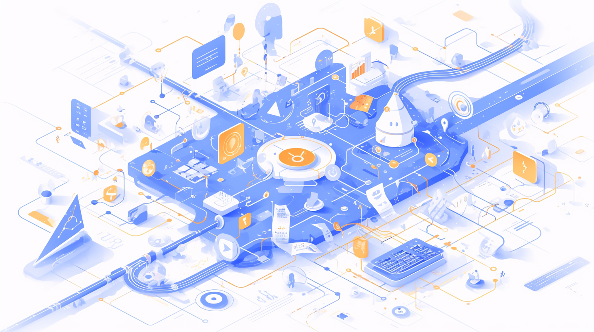

# Mermaid 图表生成器

[English](./README_EN.md) | 简体中文

Mermaid 图表生成器是一个强大的 Web 应用，旨在简化图表创建过程。通过集成先进的 AI 技术和用户友好的界面，它能够帮助用户快速创建各类专业图表，包括流程图、时序图、类图、状态图等。



## 📚 目录

- [功能特点](#功能特点)
- [快速开始](#快速开始)
- [项目结构](#项目结构)
- [开发指南](#开发指南)
- [API 文档](#api-文档)
- [测试指南](#测试指南)
- [部署指南](#部署指南)
- [常见问题](#常见问题)
- [贡献指南](#贡献指南)

## ✨ 功能特点

### 🤖 AI 辅助生成
- 支持多种 AI 模型（Kimi、DeepSeek）
- 通过自然语言描述生成 Mermaid 代码
- 保持对话上下文，支持持续优化
- 可选择不同的模型版本

### 📊 图表编辑
- 实时预览 Mermaid 图表
- 支持多种主题（默认、暗色、森林、中性）
- 可调整背景颜色（透明、白色）
- 支持多种导出格式（PNG、SVG、JPG）
- 可自定义 DPI 分辨率

### 📝 转换历史
- 自动保存所有转换记录
- 支持查看历史图表
- 可重新加载历史代码
- 支持清除历史记录

### 🎨 界面特性
- 响应式设计，支持移动端
- 支持中英文切换
- 暗色/亮色主题切换
- 直观的导航栏

## 🚀 快速开始

### 环境要求
- Node.js >= 16
- npm >= 8 或 pnpm >= 8

### 安装步骤

1. 克隆仓库：
   ```bash
   git clone https://github.com/yourusername/mermaid-general-pic.git
   cd mermaid-general-pic
   ```

2. 安装依赖：
   ```bash
   # 前端
   cd Mermaid_General_Pic-Web
   pnpm install
   
   # 后端
   cd ../Mermaid_General_Pic-Services
   pnpm install
   ```

3. 配置环境：
   ```bash
   # 前端配置
   cd Mermaid_General_Pic-Web
   cp .env.example .env
   
   # 后端配置
   cd ../Mermaid_General_Pic-Services
   cp .env.example .env
   ```

4. 启动服务：
   ```bash
   # 前端开发服务器
   cd Mermaid_General_Pic-Web
   pnpm dev
   
   # 后端开发服务器
   cd ../Mermaid_General_Pic-Services
   pnpm dev
   ```

## 📁 项目结构

```
mermaid-general-pic/
├── Mermaid_General_Pic-Web/     # 前端项目
│   ├── src/                    # 源代码
│   ├── tests/                  # 测试文件
│   └── README.md              # 前端文档
├── Mermaid_General_Pic-Services/ # 后端项目
│   ├── src/                    # 源代码
│   ├── tests/                  # 测试文件
│   └── README.md              # 后端文档
└── README.md                   # 项目总文档
```

详细的项目结构请参考：
- [前端项目结构](./Mermaid_General_Pic-Web/README.md#项目结构)
- [后端项目结构](./Mermaid_General_Pic-Services/README.md#项目结构)

## 📖 开发指南

### 技术栈
- 前端：Vue 3 + TypeScript + Element Plus
- 后端：Node.js + Express + TypeScript
- AI 集成：Kimi API、DeepSeek API
- 图表生成：Mermaid CLI

### 开发流程
1. 创建功能分支
2. 开发新功能
3. 编写测试
4. 提交代码
5. 代码审查
6. 合并到开发分支

详细的开发指南请参考：
- [前端开发指南](./Mermaid_General_Pic-Web/README.md#开发指南)
- [后端开发指南](./Mermaid_General_Pic-Services/README.md#开发指南)

## 📚 API 文档

### 基础 API
- 获取支持的格式
- 转换 Mermaid 代码
- 上传文件转换

### AI API
- 获取可用的 AI 模型
- AI 生成 Mermaid 代码

详细的 API 文档请参考：
- [API 文档](./Mermaid_General_Pic-Services/README.md#api-文档)

## 🧪 测试指南

### 前端测试
- 单元测试 (Vitest)
- 组件测试
- E2E 测试 (Cypress)
- 性能测试 (Lighthouse)

### 后端测试
- 单元测试 (Jest)
- 集成测试
- 性能测试
- API 测试

详细的测试指南请参考：
- [前端测试指南](./Mermaid_General_Pic-Web/README.md#测试指南)
- [后端测试指南](./Mermaid_General_Pic-Services/README.md#测试指南)

## 📦 部署指南

### 构建项目
```bash
# 构建前端
cd Mermaid_General_Pic-Web
pnpm build

# 构建后端
cd ../Mermaid_General_Pic-Services
pnpm build
```

### 部署检查清单
- [ ] 环境变量配置
- [ ] 依赖安装完整
- [ ] 构建成功
- [ ] API 配置正确
- [ ] 静态资源优化
- [ ] 安全配置
- [ ] 性能测试
- [ ] 日志配置

详细的部署指南请参考：
- [前端部署指南](./Mermaid_General_Pic-Web/README.md#部署)
- [后端部署指南](./Mermaid_General_Pic-Services/README.md#部署)

## ❓ 常见问题

### 开发相关
1. 开发环境配置问题
2. 依赖安装失败
3. 编译错误
4. API 调用失败

### 部署相关
1. 构建失败
2. 环境变量配置
3. 静态资源访问
4. 性能优化

详细的常见问题解答请参考：
- [前端常见问题](./Mermaid_General_Pic-Web/README.md#常见问题)
- [后端常见问题](./Mermaid_General_Pic-Services/README.md#常见问题)

## 🤝 贡献指南

我们欢迎所有形式的贡献，包括但不限于：
- 提交问题和建议
- 改进文档
- 修复 bug
- 添加新功能

### 贡献步骤
1. Fork 项目
2. 创建功能分支
3. 提交更改
4. 推送到分支
5. 创建 Pull Request

详细的贡献指南请参考：
- [贡献指南](./CONTRIBUTING.md)

## 📄 许可证

本项目采用 MIT 许可证 - 详见 [LICENSE](./LICENSE) 文件 