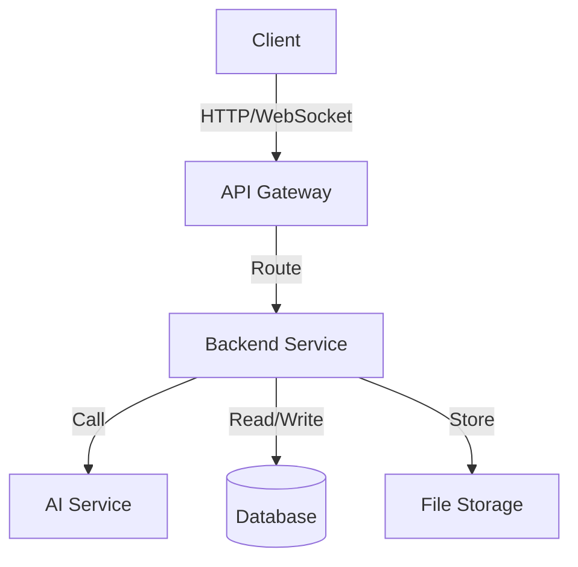
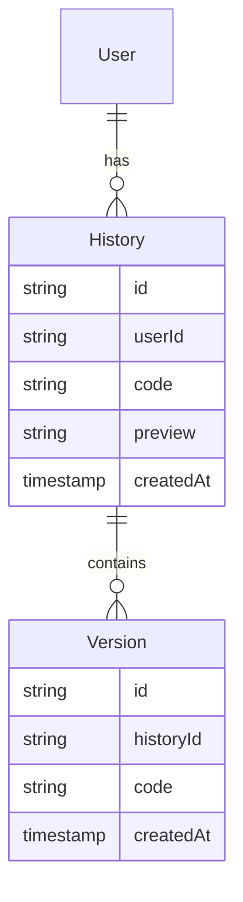
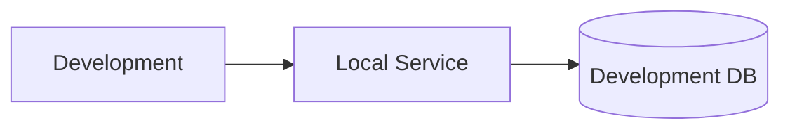
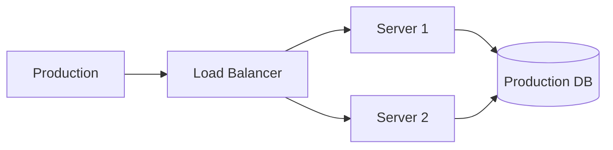

# Architecture Design

## System Architecture Overview

### Overall Architecture


### Technology Stack
- **Frontend**:
  - Vue 3: Core framework
  - TypeScript: Type system
  - Vite: Build tool
  - Element Plus: UI component library
  - Pinia: State management
  - Vue Router: Routing management
  - Monaco Editor: Code editor

- **Backend**:
  - Node.js: Runtime environment
  - Express: Web framework
  - TypeScript: Type system
  - SQLite: Data storage
  - Redis: Cache system
  - PM2: Process management

- **AI Services**:
  - Kimi API: Primary AI model
  - DeepSeek API: Alternative AI model

- **Development Tools**:
  - pnpm: Package manager
  - ESLint: Code linting
  - Prettier: Code formatting
  - Jest: Unit testing
  - Cypress: E2E testing

## Frontend Architecture

### Directory Structure
```
Mermaid_General_Pic-Web/
├── src/
│   ├── assets/          # Static assets
│   ├── components/      # Common components
│   ├── composables/     # Composable functions
│   ├── config/          # Configuration files
│   ├── layouts/         # Layout components
│   ├── locales/         # Internationalization files
│   ├── router/          # Route configuration
│   ├── stores/          # State management
│   ├── styles/          # Global styles
│   ├── types/           # Type definitions
│   ├── utils/           # Utility functions
│   └── views/           # Page components
├── public/              # Public assets
└── tests/               # Test files
```

### Core Components
- **Editor**: Code editor component
- **Preview**: Chart preview component
- **AIPrompt**: AI prompt input component
- **History**: History record component
- **ThemeSelector**: Theme selection component
- **ExportOptions**: Export options component

### State Management
- **editor**: Editor state
- **preview**: Preview state
- **ai**: AI-related state
- **history**: History record state
- **theme**: Theme state
- **user**: User state

## Backend Architecture

### Directory Structure
```
Mermaid_General_Pic-Services/
├── src/
│   ├── config/          # Configuration files
│   ├── controllers/     # Controllers
│   ├── middlewares/     # Middlewares
│   ├── models/          # Data models
│   ├── routes/          # Route definitions
│   ├── services/        # Business logic
│   ├── types/           # Type definitions
│   └── utils/           # Utility functions
├── logs/                # Log files
└── tests/               # Test files
```

### Core Services
- **MermaidService**: Chart conversion service
- **AIService**: AI generation service
- **HistoryService**: History record service
- **ExportService**: Export service
- **StorageService**: Storage service
- **CacheService**: Cache service

### Middlewares
- **auth**: Authentication middleware
- **rateLimit**: Rate limiting middleware
- **errorHandler**: Error handling
- **logger**: Logging middleware
- **cors**: CORS handling
- **compression**: Compression middleware

## Data Architecture

### Data Models


### Caching Strategy
- **Local Cache**:
  - Editor content
  - Preview results
  - User settings
  - Theme configuration

- **Server Cache**:
  - API responses
  - Chart rendering
  - AI generation results
  - Session state

## Security Architecture

### Security Measures
- HTTPS encryption
- API authentication and authorization
- Input validation and filtering
- XSS/CSRF protection
- Request rate limiting
- Data backup

### Error Handling
- Global error catching
- Error logging
- User-friendly error messages
- Error recovery mechanism
- Fallback strategies

## Deployment Architecture

### Development Environment


### Production Environment


## Monitoring and Logging

### Monitoring Metrics
- System performance
- API response time
- Error rates
- Resource utilization
- User activity
- AI service status

### Logging System
- Access logs
- Error logs
- Performance logs
- Security logs
- Operation logs

## Extensibility Design

### Plugin System
- Custom themes
- Chart templates
- Export formats
- AI models
- Language packs

### Microservices
- Service splitting
- Service discovery
- Load balancing
- Fault tolerance
- Service monitoring

## Language Switch

- [English Version](./architecture.md)
- [中文版本](../../zh/development/architecture.md) 