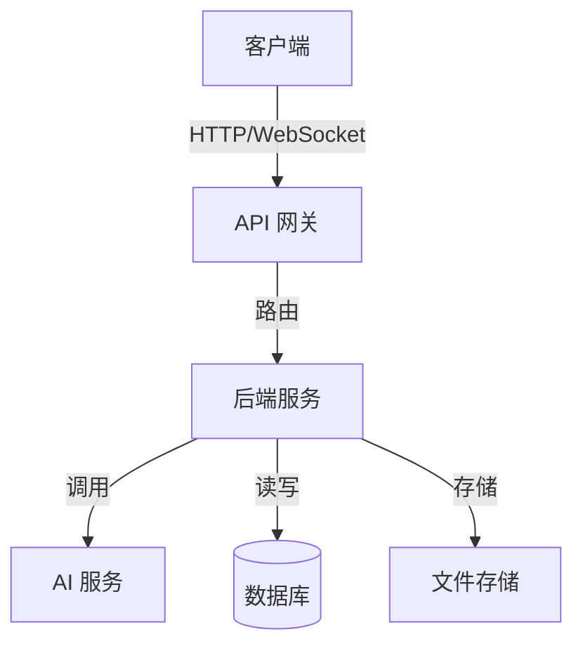
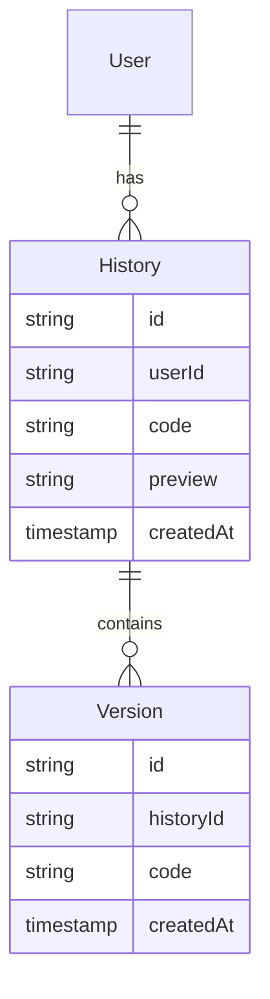
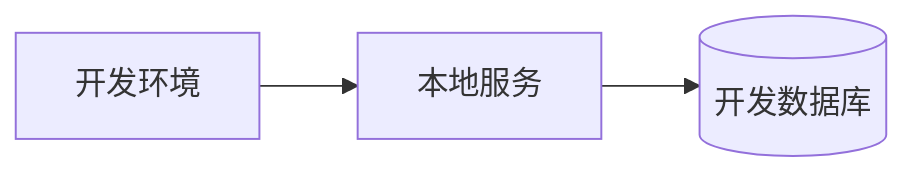
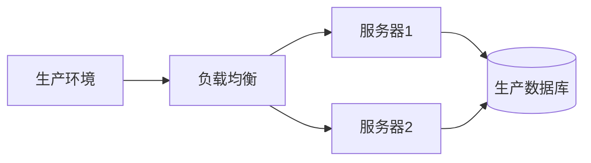

# 架构设计

## 系统架构概览

### 整体架构


### 技术栈
- **前端**：
  - Vue 3：核心框架
  - TypeScript：类型系统
  - Vite：构建工具
  - Element Plus：UI 组件库
  - Pinia：状态管理
  - Vue Router：路由管理
  - Monaco Editor：代码编辑器

- **后端**：
  - Node.js：运行环境
  - Express：Web 框架
  - TypeScript：类型系统
  - SQLite：数据存储
  - Redis：缓存系统
  - PM2：进程管理

- **AI 服务**：
  - Kimi API：主要 AI 模型
  - DeepSeek API：备选 AI 模型

- **开发工具**：
  - pnpm：包管理器
  - ESLint：代码检查
  - Prettier：代码格式化
  - Jest：单元测试
  - Cypress：E2E 测试

## 前端架构

### 目录结构
```
Mermaid_General_Pic-Web/
├── src/
│   ├── assets/          # 静态资源
│   ├── components/      # 通用组件
│   ├── composables/     # 组合式函数
│   ├── config/          # 配置文件
│   ├── layouts/         # 布局组件
│   ├── locales/         # 国际化文件
│   ├── router/          # 路由配置
│   ├── stores/          # 状态管理
│   ├── styles/          # 全局样式
│   ├── types/           # 类型定义
│   ├── utils/           # 工具函数
│   └── views/           # 页面组件
├── public/              # 公共资源
└── tests/               # 测试文件
```

### 核心组件
- **Editor**: 代码编辑器组件
- **Preview**: 图表预览组件
- **AIPrompt**: AI 提示输入组件
- **History**: 历史记录组件
- **ThemeSelector**: 主题选择组件
- **ExportOptions**: 导出选项组件

### 状态管理
- **editor**: 编辑器状态
- **preview**: 预览状态
- **ai**: AI 相关状态
- **history**: 历史记录状态
- **theme**: 主题状态
- **user**: 用户状态

## 后端架构

### 目录结构
```
Mermaid_General_Pic-Services/
├── src/
│   ├── config/          # 配置文件
│   ├── controllers/     # 控制器
│   ├── middlewares/     # 中间件
│   ├── models/          # 数据模型
│   ├── routes/          # 路由定义
│   ├── services/        # 业务逻辑
│   ├── types/           # 类型定义
│   └── utils/           # 工具函数
├── logs/                # 日志文件
└── tests/               # 测试文件
```

### 核心服务
- **MermaidService**: 图表转换服务
- **AIService**: AI 生成服务
- **HistoryService**: 历史记录服务
- **ExportService**: 导出服务
- **StorageService**: 存储服务
- **CacheService**: 缓存服务

### 中间件
- **auth**: 认证中间件
- **rateLimit**: 限流中间件
- **errorHandler**: 错误处理
- **logger**: 日志中间件
- **cors**: 跨域处理
- **compression**: 压缩中间件

## 数据架构

### 数据模型


### 缓存策略
- **本地缓存**：
  - 编辑器内容
  - 预览结果
  - 用户设置
  - 主题配置

- **服务器缓存**：
  - API 响应
  - 图表渲染
  - AI 生成结果
  - 会话状态

## 安全架构

### 安全措施
- HTTPS 加密传输
- API 认证和授权
- 输入验证和过滤
- XSS/CSRF 防护
- 请求限流
- 数据备份

### 错误处理
- 全局错误捕获
- 错误日志记录
- 友好错误提示
- 错误恢复机制
- 降级策略

## 部署架构

### 开发环境


### 生产环境


## 监控和日志

### 监控指标
- 系统性能
- API 响应时间
- 错误率
- 资源使用率
- 用户活动
- AI 服务状态

### 日志系统
- 访问日志
- 错误日志
- 性能日志
- 安全日志
- 操作日志

## 扩展性设计

### 插件系统
- 自定义主题
- 图表模板
- 导出格式
- AI 模型
- 语言包

### 微服务化
- 服务拆分
- 服务发现
- 负载均衡
- 容错处理
- 服务监控

## 语言切换

- [English Version](../en/development/architecture.md)
- [中文版本](./architecture.md) 